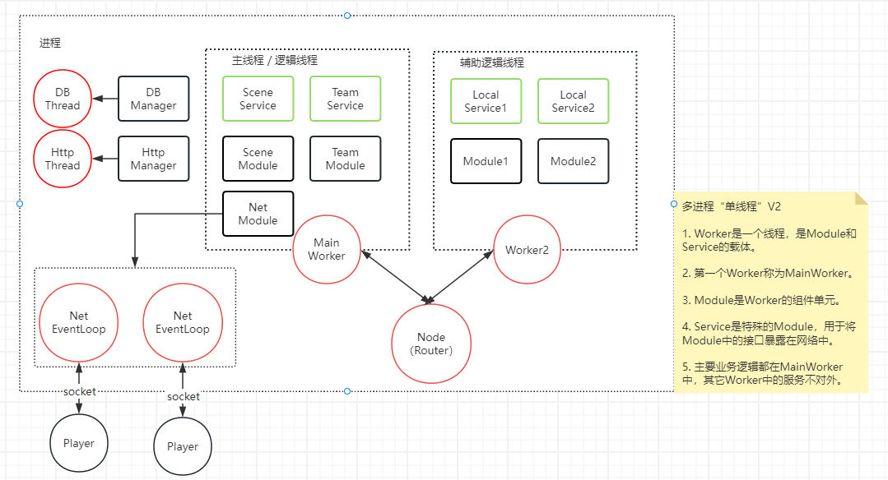
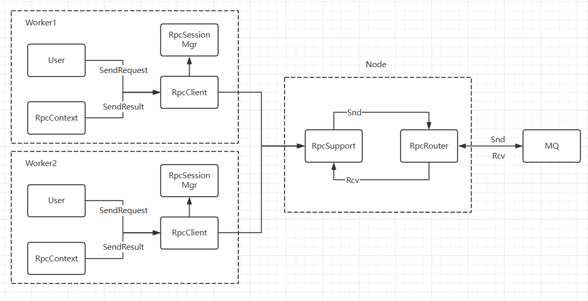

# BigCat Java实现

## 核心架构介绍

### 线程进程架构

### Rpc消息流转

------------------------------------------------

## 项目划分

由于Apt(注解处理器)必须预先打包为Jar才能被其它模块使用，因此Apt必须声明为独立的项目，因此BigCat包含三个项目：apts、framework、tools。

1. apts是注解处理器、必须先安装为jar，才能为其它模块提供服务。
2. framework框架包，是游戏相关的部分。
3. tools是辅助工具包，是开发期间使用的，比如：注解处理器、导表工具、协议预处理工具等

注意： **其它项目都不直接依赖tools，只依赖它产生的文件**。tools项目下的工具也不直接依赖framework下的类文件，生成代码更多依赖类路径和类名。

## 如何编译该项目

1. 该项目的3个子项目需要分别独立编译。
2. 进入apts目录，执行 `mvn clean install`，安装apt到本地。
3. 如果加载了apts项目请卸载(unlink)，apts项目不能和其它项目一块编译。
4. 进入framework或tools项目，可正常开始编译。

Q：编译报生成的XXX文件不存在？  
A：请先确保`apts`项目安装成功，如果已安装成功，请仔细检查编译输出的错误信息，通常是忘记getter等方法，修改错误后先clean，然后再编译。

Q：编译成功，但文件曝红，找不到文件？  
A：请将各个模块 `target/generated-sources/annotations` 设置为源代码目录（mark directory as generated source root）;   
将各个模块 `target/generated-test-sources/test-annotations` 设置为测试代码目录（mark directory as test source root）。